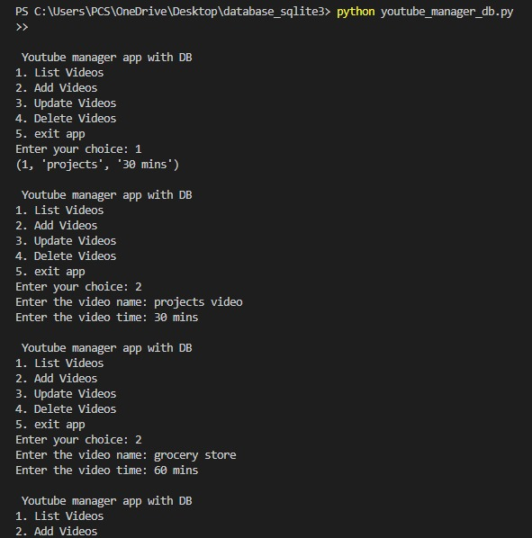

# youtube_manager_app
A simple and efficient Python CLI app to manage YouTube videos with SQLite-powered persistent storage and full CRUD functionality.
# YouTube Manager App (Python + SQLite3)

A simple command-line CRUD application to manage your YouTube videos using Python and SQLite3.

## Features

- **Add new videos** with name and time.
- **List all videos** stored in the database.
- **Update existing videos** by ID.
- **Delete videos** by ID.
- All data is stored locally in an SQLite database file.

## Requirements

- Python 3.x installed on your system.
- No external libraries required (uses Python's built-in `sqlite3`).

## How to Run

1. **Clone or Download the Repository**
   - Download the code files to your local machine.

2. **Open Terminal/Command Prompt**
   - Navigate to the folder where you saved the code.

3. **Run the App**
   - Type the following command and press Enter:
     ```
     python your_script_name.py
     ```
     Replace `your_script_name.py` with the actual filename.

4. **Use the App**
   - You will see a menu with options:
     - `1. List Videos` — Show all videos in the database.
     - `2. Add Videos` — Add a new video (enter name and time).
     - `3. Update Videos` — Update an existing video by its ID.
     - `4. Delete Videos` — Delete a video by its ID.
     - `5. Exit app` — Close the application.

## Example Usage

- **Add a Video:**  
  Select option 2, enter the video name and time when prompted.

- **List Videos:**  
  Select option 1 to see all videos with their IDs.

- **Update a Video:**  
  Select option 3, enter the video ID you want to update, then provide the new name and time.

- **Delete a Video:**  
  Select option 4, enter the video ID you want to delete.

## Notes

- The database file `youtube_videos.db` will be created automatically in the same folder as the script.
- Make sure to enter correct IDs when updating or deleting videos.
- To stop the app, select option 5.

# 📸 Screenshots

### 1. App Start & Listing Existing Videos
This screenshot shows the initial menu and listing of existing videos in the database.


---

### 2. Adding Videos to Database
User adds new videos like `projects video` and `grocery store`, and they are saved successfully.


---

### 3. Updating Video Information
User updates the video with ID 1 to `snake game` with new duration.



